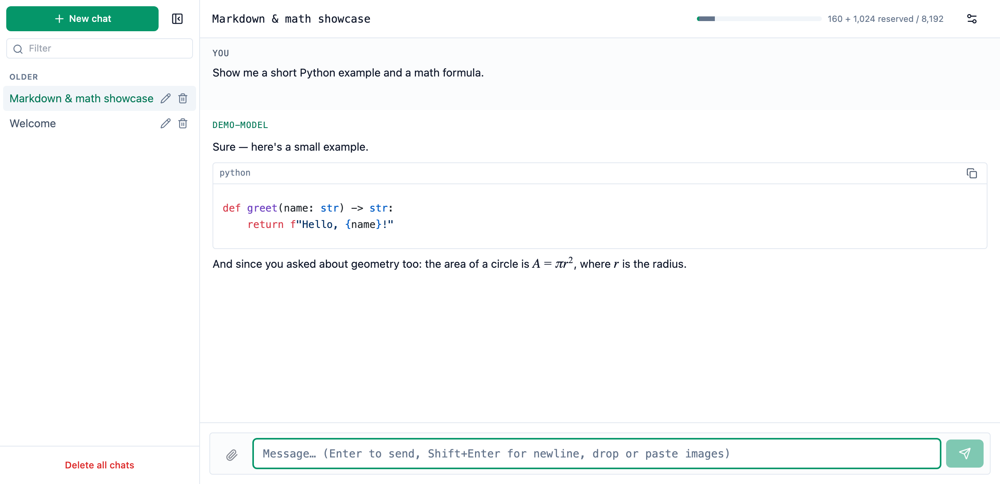
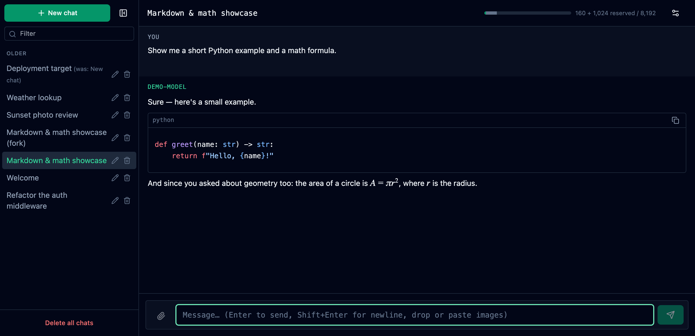
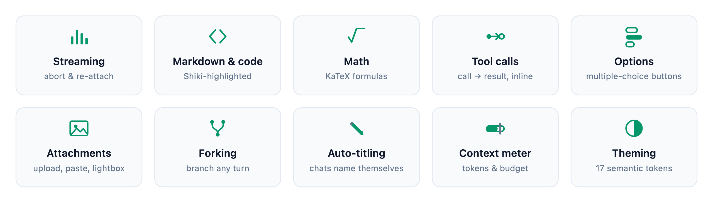
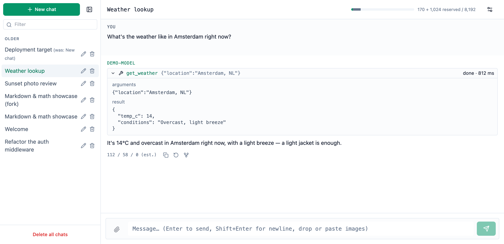
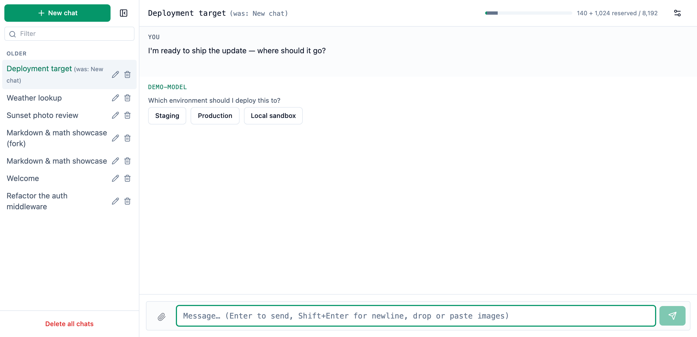
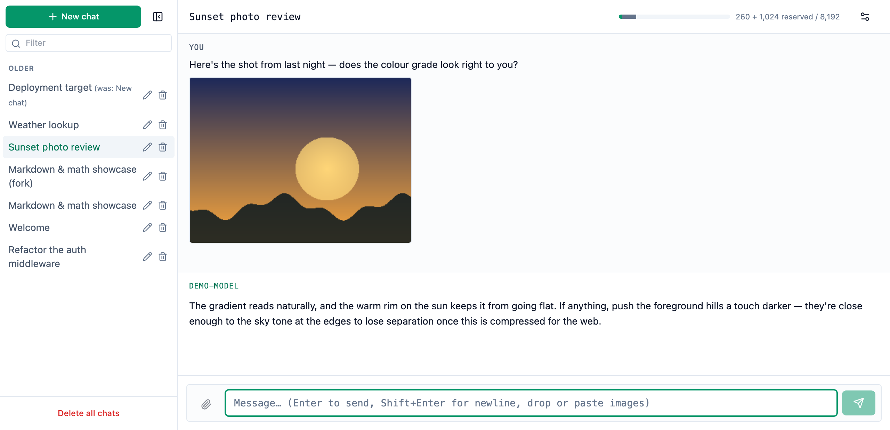
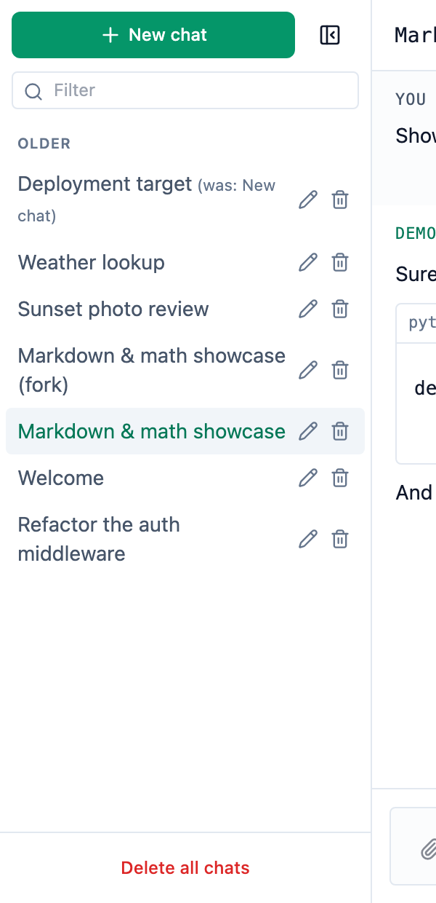
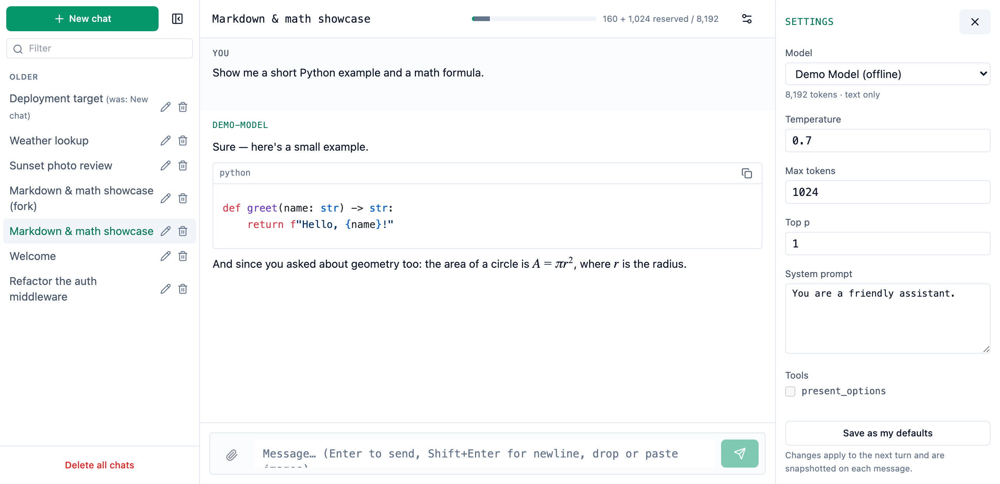

# @podwarden/chat-ui

A persisted, streaming chat UI for React, and the backend contract it talks
to — built around the parts that don't show up in a demo: a reload mid-answer,
an abort that has to actually stop the model, and markdown that can't flinch
at a token boundary.

| Light | Dark |
|---|---|
|  |  |

## Streaming looks like the easy part

Getting tokens to appear one at a time is a `for await` loop and an hour of
work. The part that costs real time shows up right after: the user reloads
mid-answer, and now the UI has to reattach to a turn that is still running on
the server, not just replay whatever already streamed. They hit **Stop**, and
you find out whether that stopped your local reader or actually cancelled the
generation your bill is metered on. The reply lands with a fenced code block
cut off mid-line, and the markdown renderer either throws or flashes raw HTML
for one frame. Nobody notices the token-accounting bug until the invoice
doesn't match what the UI showed all month.

If any of that sounds like a bug you've filed against your own chat feature,
this package is the part after the demo — re-attach, abort semantics, token
accounting, and a renderer that doesn't break mid-token, already handled.

## Install

```bash
npm install @podwarden/chat-ui
```

Every release is published from CI with
[provenance](https://docs.npmjs.com/generating-provenance-statements), so you can
check that the code on npm was built from the commit it claims, by a workflow in
this repository, before you trust it:

```bash
npm audit signatures
```

## Mount it

```tsx
'use client';
import { ChatApp } from '@podwarden/chat-ui';
import { createHttpAdapters } from '@podwarden/chat-ui/adapters-http';
import { useMemo } from 'react';

export function Chat({ baseUrl }: { baseUrl: string }) {
  // Keep the adapters object stable — a new one on every render remounts the thread.
  const adapters = useMemo(() => createHttpAdapters({ baseUrl, fetch }), [baseUrl]);
  return <ChatApp adapters={adapters} theme="dark" />;
}
```

React 19 (`react`, `react-dom`) is a peer dependency. Import
`@podwarden/chat-ui/theme.css` (or supply the 17 tokens yourself — see
Theming, below the fold) or the chat renders as unstyled HTML.

## Try it with no backend

**[Open the live demo →](https://podwarden.github.io/chat-ui/)** — no install, no
clone, no backend. It is `examples/basic` below, built from `main` and running
entirely in your browser.

To run the same thing locally, or to change it:

```bash
git clone https://github.com/Podwarden/chat-ui.git && cd chat-ui
npm install && npm run build   # examples/basic depends on the built dist/
cd examples/basic && npm install && npm run dev
```

`examples/basic` wires the full UI to an in-memory `Adapters` implementation —
no server, no port, no SSE parsing — and it isn't a toy conversation. It seeds
a sidebar of real chats: a tool call and its result, the `present_options`
multiple-choice selector, a message with an image attachment, a chat forked
mid-conversation, and a markdown-and-math showcase, each with a title an
actual user would give it.

This is the fastest way to see the library working end to end, and it is also
the **reference implementation** for wiring it into a product: `Transport.
sendTurn(req, onEvent, signal)` delivers every event this demo emits by plain
callback (see `examples/basic/src/demo-adapters.ts`), so the same file that
makes the demo self-contained is a working example of every method your own
`Adapters` object has to implement. Integration is meant to be this direct —
if your backend can produce the documented event sequence, this is what
wiring it up looks like. The whole directory is CC0 — copy it into your own
app with no attribution obligations.

## What you get

<picture>
  <source media="(prefers-color-scheme: dark)" srcset="docs/assets/features-dark.png">
  
</picture>

- **Streaming** turns over SSE, with mid-stream abort and re-attach to a turn
  still running server-side after a reload — the two failure modes a demo
  never has to handle.
- **Markdown**, Shiki-highlighted code blocks, and KaTeX math, rendered safely
  (sanitized HTML, no raw script execution) and incrementally, so a fenced
  block or a formula doesn't wait for the whole message to finish streaming
  before it lights up — the screenshot at the top of this page is that code
  block and that formula, rendered live.

- **Tool calls**, rendered as a collapsible call/result block — durations,
  arguments, and the result, whatever shape it comes back in:

  <picture>
    <source media="(prefers-color-scheme: dark)" srcset="docs/assets/tool-call-dark.png">
    
  </picture>

- **The `present_options` selector** — a model can offer the user a small set
  of choices as buttons instead of asking them to type an answer to a
  multiple-choice question:

  <picture>
    <source media="(prefers-color-scheme: dark)" srcset="docs/assets/options-dark.png">
    
  </picture>

- **Attachments** — drag-drop, the file picker, or paste straight from the
  clipboard; images in, thumbnails and a zoom-and-pan lightbox out:

  <picture>
    <source media="(prefers-color-scheme: dark)" srcset="docs/assets/attachments-dark.png">
    
  </picture>

- **Fork and edit** — branch a chat from any past message, or edit and
  regenerate a turn, without losing the original.
- **Automatic chat titling** — chats title themselves, and the sidebar shows
  what a chat used to be called next to what it's called now, so a rename
  never makes a chat unrecognisable. Forking shows up in the same list, as an
  ordinary row with its own title:

  <picture>
    <source media="(prefers-color-scheme: dark)" srcset="docs/assets/sidebar-dark.png">
    
  </picture>

- **Context and budget meters** — a token gauge in the header and a
  cost-against-budget bar, both fed by the same events the transcript is.
- **Per-chat settings** — model, temperature, top‑p, max tokens, system
  prompt and enabled tools, editable per chat and snapshotted on every
  message:

  <picture>
    <source media="(prefers-color-scheme: dark)" srcset="docs/assets/settings-dark.png">
    
  </picture>

- **Theming** through 17 semantic `--chat-*` tokens and a Tailwind preset, so
  a host restyles the whole UI without overriding a single component.

## Used in production

This component is the chat surface in **PodWarden Hub** and **LLM Warden**.

It also powers the chat interface in [Synapse](https://www.catalation.com/)
by Catalation — a "Business as a Service" platform where the entire
interaction model is a conversation with a virtual CEO agent that
orchestrates the rest of the system and escalates only the decisions the
founder needs to make. For Synapse, chat isn't a panel bolted onto a
dashboard; it's the product's only interface — a different bar to clear than
a support widget in the corner of a screen.

## Where this fits

- **Embedding an assistant in an existing product** — a chat panel next to
  whatever your app already does, without inheriting a chat framework's
  opinions about your layout.
- **A self-hosted LLM front-end** — point `createHttpAdapters` at your own
  inference server and get a full chat UI without writing one.
- **Giving an internal tool a chat surface** — the fastest way to put a
  conversational interface in front of a system your team already runs.
- **Building on the contract with your own backend** — implement
  `openapi.chat.json`'s routes and the documented SSE events, and `<ChatApp>`
  drives them; you own the model, the tools, and the storage.

## The backend contract

`openapi.chat.json` describes the wire protocol this package speaks. Any
backend that implements it — not just the ones this package ships adapters
for — can drive `<ChatApp>`. Prove it with the shipped conformance suite
against a live server, one file:

```ts
import { runConformance } from '@podwarden/chat-ui/conformance';

runConformance({ baseUrl: 'http://127.0.0.1:8000/api/chat2', fetch: authedFetch });
```

`runConformance` registers `describe`/`it` blocks in the calling file rather
than running anything itself, talks to the server only through the injected
`fetch`, and cleans up every chat it creates.

**How does your backend behave when a client reattaches mid-turn?** If the
answer is "I haven't tested that", the conformance suite's `live-replay` group
opens a turn, reconnects to it through `GET .../turn/live`, and asserts the
replayed frames are byte-identical to the original — before your users find
out the hard way.

## Entry points

| Import | What it is |
|---|---|
| `@podwarden/chat-ui` | The chat UI React components. Carries `'use client'`. |
| `@podwarden/chat-ui/contract` | Request/response types, the SSE event union, `ApiError`, `CONTRACT_VERSION`. React-free. |
| `@podwarden/chat-ui/adapters-http` | `createHttpAdapters({ baseUrl, fetch })` — the contract over HTTP. React-free. |
| `@podwarden/chat-ui/conformance` | `runConformance(...)` — a runnable suite proving a backend speaks the contract. |
| `@podwarden/chat-ui/openapi.chat.json` | The wire protocol as OpenAPI. |

## Licence

Apache-2.0. See [LICENSE](LICENSE) and [NOTICE](NOTICE). Everything under
`examples/` is CC0 — copy it freely.

"PodWarden" is a trademark of its owner. The licence does not grant permission
to use the trade names, trademarks, or product names of the licensor, except
as required for reasonable and customary use in describing the origin of the
work.

---

## Reference

The sections above are the pitch. What follows is deeper integration detail —
for a host that already knows it wants this package and needs the specifics.

### About this repository

This repository is the public source mirror of the library, published under
Apache-2.0. It carries the source and the build of every module the package
ships — `npm ci && npm run build` here produces the same `dist/` that is
released. The internal test suite, the GitLab CI machinery, the `publish/`
tooling that produces this mirror, `.npmrc.example`, `screenshots/` and
`playwright.config.ts` (the screenshot-generation harness), and
`docs/superpowers/` (internal design docs) stay behind in the private
repository.

### Theming, in full

The package paints exclusively through 17 semantic `--chat-*` CSS variables and
Tailwind classes named after them, so a host restyles it without overriding a
single component. Each variable is a space-separated `R G B` triplet with no
`rgb()` wrapper, so alpha composes onto it (`bg-chat-surface/50`):

```
--chat-page  --chat-surface  --chat-surface-2  --chat-rule  --chat-fg
--chat-muted --chat-dim      --chat-accent     --chat-accent-strong
--chat-user  --chat-warn     --chat-warn-dim   --chat-negative
--chat-negative-dim          --chat-positive   --chat-code  --chat-on-accent
```

`@podwarden/chat-ui/theme.css` ships a complete dark default for all 17.

**Tailwind 3.4 hosts** add the preset and the scan path:

```js
presets: [require('@podwarden/chat-ui/tailwind-preset')],
content: ['./src/**/*.{ts,tsx}', './node_modules/@podwarden/chat-ui/dist/**/*.js'],
```

**Tailwind 4 hosts** have no `presets` or `content`; use `@source` plus a
`@theme` block mapping each `--color-chat-*` to `rgb(var(--chat-*))`:

```css
@import 'tailwindcss';
@source "../node_modules/@podwarden/chat-ui/dist";

@theme {
  --color-chat-page: rgb(var(--chat-page));
  /* …one line per token… */
}
```

Either way the host must define the 17 triplets. Skipping this step renders the
chat as unstyled HTML.

### `vitest` peer

`vitest` is an *optional* peer dependency, needed only by the `./conformance`
entry.
